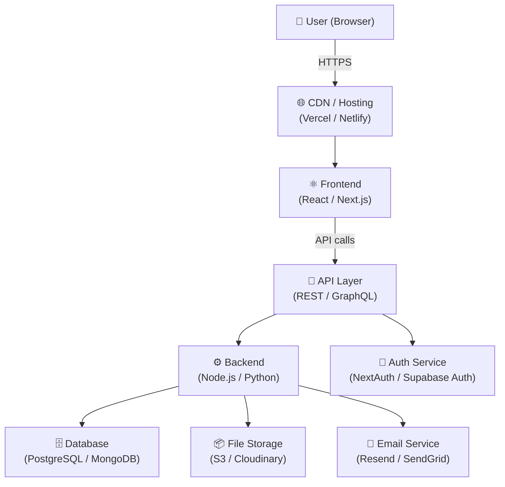
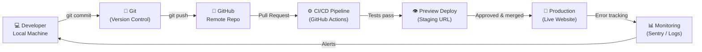
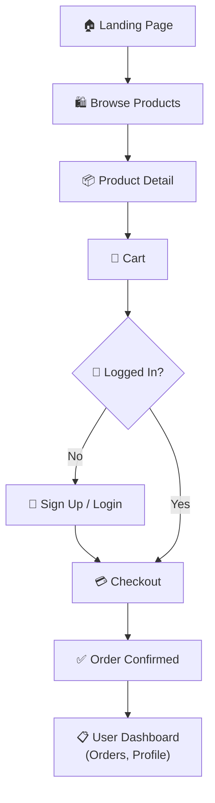
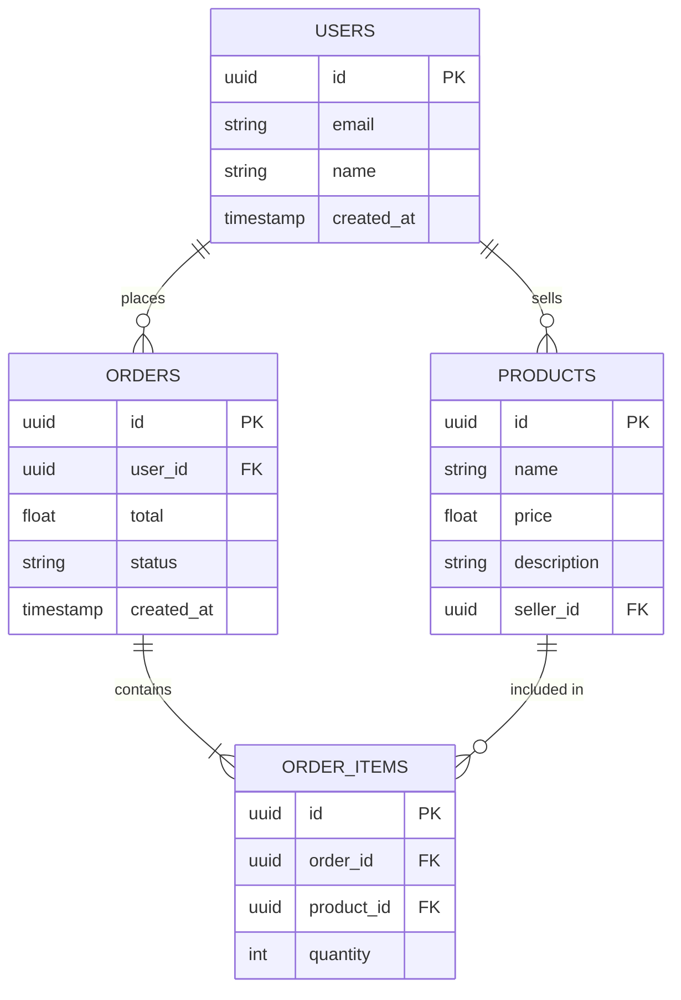

# Website Project Architect

A step-by-step planning skill that guides users from a rough website idea to a full, industry-grade implementation plan — including tech stack selection, architecture diagram, feature suggestions, security checklist, and a detailed markdown document. Designed for ALL skill levels, especially non-technical users.

---

## Stage 0 — Understand the Project

Before anything else, gather context. Ask the user these questions (combine into one conversational message — don't fire them as a list of bullet points):

1. **What is your website about?** (A short description of what it does and who it's for)
2. **What is the main goal?** (e.g. sell products, share content, connect people, provide a service)
3. **Do you expect many users?** (Small = <1000/month, Medium = 1000–100k/month, Large = 100k+)
4. **Do you have a budget preference?** (Free/Open Source only, Low budget, Flexible)
5. **Do you have any technical experience?** (None, Some, Comfortable with code)

If the user has already described their project in the conversation, extract what you can and only ask for what's missing. Keep the tone friendly and jargon-free.

---

## Stage 1 — Tech Stack Recommendation

Based on the description and answers, recommend a tech stack. Always explain WHY each choice was made in plain English.

### How to choose:

Read `/references/stacks.md` for a full mapping of project types → recommended stacks.

Present the recommendation in this format:

```
## 🛠️ Recommended Tech Stack

### Frontend (what users see)
- **Tool**: [Name]
- **Why**: [1-2 sentence plain English reason]
- **Difficulty**: Beginner / Intermediate / Advanced

### Backend (the engine behind the scenes)
- **Tool**: [Name]
- **Why**: [1-2 sentence plain English reason]
- **Difficulty**: Beginner / Intermediate / Advanced

### Database (where your data lives)
- **Tool**: [Name]
- **Why**: [reason]

### Authentication (login / sign-up system)
- **Tool**: [Name]
- **Why**: [reason]

### Deployment & Hosting (putting it live on the internet)
- **Options to consider**: [list 2-3 based on their budget/scale]
- Ask the user: "Which of these fits best for you, or would you like more info on each?"

### Alternatives
List 1-2 alternative stacks and when someone might prefer them over your recommendation.
```

**Always ask the user to confirm or adjust** before moving to Stage 2. Say something like:
> "This is my recommendation based on your description. Feel free to swap anything out — just let me know and I'll adjust the plan!"

---

## Stage 2 — Feature List & User Control

Generate a feature list split into three tiers. Present as a checklist the user can respond to.

```
## ✨ Feature Suggestions

### Core Features (essential — highly recommended)
- [ ] User authentication (sign up, log in, log out)
- [ ] [Project-specific core feature 1]
- [ ] [Project-specific core feature 2]
- [ ] Responsive design (works on mobile + desktop)

### Nice-to-Have Features (add when ready)
- [ ] [Feature based on description]
- [ ] Email notifications
- [ ] Admin dashboard
- [ ] Search functionality
- [ ] [Other relevant feature]

### Advanced / Future Features (for later)
- [ ] AI-powered recommendations
- [ ] Analytics dashboard
- [ ] Multi-language support
- [ ] [Other relevant feature]
```

Tell the user:
> "Check off which features you want to include. You can always add more later — this just helps us build the right plan!"

Wait for the user to confirm their feature selection before moving to Stage 3.

---

## Stage 3 — Implementation Plan & Architecture Diagram

Once tech stack and features are confirmed, generate two outputs:

### 3A — Architecture Diagram (Mermaid)

Always produce a Mermaid flowchart showing the system architecture. Save it as a `.mermaid` file so it renders visually.

Example structure (adapt to the actual project):



Adapt nodes based on the actual chosen stack and features. Add or remove nodes as appropriate.

### 3B — Detailed Implementation Plan (Markdown)

Generate a full implementation plan document. See `/references/implementation-template.md` for the full template to use.

The plan must include:
- Project overview
- Tech stack summary
- Phase-by-phase development roadmap (with time estimates)
- File/folder structure
- Key integrations
- Security checklist (Stage 4 is embedded here)
- Launch checklist
- Resources & learning links

---

### 3C — Development Workflow & Project Structure

This is a required output — always generate it alongside the implementation plan. Read `/references/workflow-templates.md` for framework-specific folder structures.

Generate **three Mermaid diagrams** and **one folder tree**:

#### Diagram 1 — Full Development Workflow (Git + CI/CD)

Show how code moves from developer's computer → GitHub → production. Adapt based on hosting choice.



#### Diagram 2 — User Journey Flow

Show the key screens/pages and how a user navigates through the website. Tailor this completely to the actual project — use the feature list from Stage 2.

Example for an e-commerce site (adapt to the real project):


#### Diagram 3 — Database Schema Overview

Show the main data tables/collections and how they relate. Tailor to the actual project — deduce from the description and features.

Example (adapt entirely to the real project):


#### Folder Structure

Generate the full recommended folder/file structure for the chosen framework. Read `/references/workflow-templates.md` for framework-specific trees.

Present as a clearly annotated code block with comments explaining what each folder is for. Example (Next.js — adapt to actual stack):

```
my-project/
│
├── 📁 app/                          # All pages live here (Next.js App Router)
│   ├── 📁 (auth)/                   # Login & signup pages (grouped, no URL impact)
│   │   ├── login/page.tsx
│   │   └── signup/page.tsx
│   ├── 📁 (dashboard)/              # Pages only logged-in users see
│   │   ├── layout.tsx               # Shared layout for dashboard
│   │   └── profile/page.tsx
│   ├── 📁 api/                      # Your backend API endpoints
│   │   ├── auth/[...nextauth]/      # Auth handler
│   │   └── [feature]/route.ts       # API route for each feature
│   ├── layout.tsx                   # Root layout (fonts, providers)
│   └── page.tsx                     # Home page
│
├── 📁 components/                   # Reusable UI building blocks
│   ├── 📁 ui/                       # Generic: Button, Input, Card, Modal
│   ├── 📁 layout/                   # Navbar, Footer, Sidebar
│   └── 📁 [feature]/                # Feature-specific components
│
├── 📁 lib/                          # Helper code and utilities
│   ├── db.ts                        # Database client setup
│   ├── auth.ts                      # Auth configuration
│   └── utils.ts                     # Shared helper functions
│
├── 📁 hooks/                        # Custom React hooks
│
├── 📁 types/                        # TypeScript type definitions
│
├── 📁 public/                       # Static files (images, icons, fonts)
│
├── 📁 prisma/ OR supabase/          # Database schema and migrations
│   └── schema.prisma
│
├── .env.local                       # 🔴 SECRET KEYS — never commit to Git!
├── .gitignore                       # Tells Git what NOT to track
├── next.config.js                   # Next.js configuration
├── tailwind.config.ts               # Styling configuration
└── package.json                     # Project dependencies list
```

#### Git Branching Strategy

Include a simple branching workflow appropriate to the team size:

**For solo developers / small teams:**
```
main          → live production site (always stable)
  └── dev     → your working branch (push here daily)
        └── feature/[name]  → one branch per new feature
```

**Rules:**
- Never push broken code directly to `main`
- Create a new branch for each feature: `git checkout -b feature/user-login`
- Merge to `dev` first, test it, then merge `dev` → `main` to deploy

---

## Stage 4 — Security & Vulnerability Review

This stage runs **automatically** as part of Stage 3 — embed a security section in the implementation plan. Never skip this.

Read `/references/security-checklist.md` for the full checklist.

Always include a section like:

```markdown
## 🔒 Security Checklist

### Authentication & Authorization
- [ ] Use industry-standard auth (OAuth2, JWT, or managed auth like Supabase/Clerk)
- [ ] Never store passwords in plain text — use bcrypt or similar hashing
- [ ] Implement role-based access control (RBAC) if multiple user types exist

### Data Protection
- [ ] Validate and sanitize ALL user inputs (prevent SQL injection, XSS)
- [ ] Use HTTPS everywhere — no exceptions
- [ ] Store secrets (API keys, DB passwords) in environment variables, never in code

### API Security
- [ ] Rate limiting on all public API endpoints
- [ ] CORS policy configured to allow only your own domain
- [ ] API keys never exposed in frontend code

### Infrastructure
- [ ] Regular database backups configured
- [ ] Dependency scanning (npm audit / pip check) before launch
- [ ] Error messages never expose internal system details to users

### Compliance (if applicable)
- [ ] GDPR: Cookie consent + data deletion on request
- [ ] If handling payments: PCI-DSS compliance via Stripe/Paddle (never store raw card data)
```

Flag any high-risk items specific to the described project with a ⚠️ warning.

---

## Stage 5 — Final Deliverable

Produce these output files:

1. **`architecture-diagram.mermaid`** — System architecture diagram (Stage 3A)
2. **`user-journey.mermaid`** — User flow through the website (Stage 3C Diagram 2)
3. **`database-schema.mermaid`** — Data model and relationships (Stage 3C Diagram 3)
4. **`dev-workflow.mermaid`** — Git and CI/CD pipeline (Stage 3C Diagram 1)
5. **`implementation-plan.md`** — Full plan including folder structure, roadmap, security checklist
6. **`ai-build-guide.md`** — AI tool recommendation + ready-to-use starter prompt (Stage 6)
7. **`prompt-kit.md`** — Full copy-paste prompt library for every feature (Stage 7)
8. **`website-copy.md`** — All website text: headlines, CTAs, page copy, ready to paste (Stage 8)
9. **`design-brief.md`** — Colors, fonts, layout style, UI direction for the AI tool (Stage 9)
10. **`legal-pages.md`** — Privacy Policy, Terms of Service, Cookie Policy starter templates (Stage 10)

Present all files to the user. Then say:
> "Your complete website blueprint is ready! Here's everything you have:
> - **4 diagrams** — system, user journey, database, dev workflow
> - **1 implementation plan** — roadmap, folder structure, security checklist
> - **1 AI build guide** — which tool to open and your starter prompt, ready to paste
> - **1 prompt kit** — copy-paste prompts for every feature, setup, and debugging
> - **1 website copy doc** — all the words your website needs, ready to paste in
> - **1 design brief** — colors, fonts, and style so your site looks professional
> - **1 legal pages doc** — Privacy Policy, Terms, and Cookie Policy starter templates
>
> You have everything you need to build, launch, and run your website without needing a developer. Want me to adjust anything?"

---

## Stage 6 — AI Tool Guide & Starter Prompt

This stage picks the best AI agentic coding tool for this user's skill level and project, then generates a ready-to-paste starter prompt they can use immediately. Read `/references/ai-tools.md` for the full tool comparison.

### 6A — Pick the Right AI Tool

Based on the user's technical experience (from Stage 0) and the chosen stack, recommend ONE primary tool:

| Technical Experience | Recommended Tool | Why |
|---|---|---|
| None / Complete beginner | Google AI Studio | No setup, browser-based, auto-wires database + auth from your description, free |
| Some experience | Bolt.new or Lovable | Visual feedback, instant preview, no terminal needed |
| Comfortable with code | Cursor or Claude Code | Full IDE power, works with any framework, best for complex apps |

Present the recommendation like this:

```
## 🤖 Your AI Coding Tool

**Recommended: [Tool Name]**
**Why this one for you**: [1-2 sentences tailored to their skill level and project]
**Where to open it**: [URL]
**Cost**: [Free tier details]

### How to get started in 3 steps:
1. Go to [URL] and create a free account
2. Click [specific button name, e.g. "New Project" or "Prototype this app"]
3. Paste your Starter Prompt below 👇
```

### 6B — Generate the Starter Prompt

Generate a single, complete, copy-paste ready prompt the user can drop into their chosen AI tool. This prompt must be specific enough that the AI tool can scaffold the entire project without further clarification.

**Rules for writing the starter prompt:**
- Name the exact tech stack chosen in Stage 1
- List every core feature confirmed in Stage 2
- Describe the pages/screens needed
- Mention the target user and purpose
- Include the database structure at a high level
- Specify auth requirements
- Ask the tool to set up the folder structure and basic navigation first

**Template to follow** (fill in all details from earlier stages):

```
Build me a [type of website] called "[project name or description]".

**Purpose**: [What the site does and who uses it]

**Tech Stack**:
- Frontend: [framework]
- Backend: [backend/BaaS]
- Database: [database]
- Auth: [auth provider]
- Hosting: [hosting platform]

**Pages to create**:
1. [Page 1] — [what it shows/does]
2. [Page 2] — [what it shows/does]
3. [Page 3] — [what it shows/does]
[continue for all pages]

**Core features to implement**:
- [Feature 1]
- [Feature 2]
- [Feature 3]
[continue for all confirmed core features]

**Database tables needed**:
- [Table 1]: [key fields]
- [Table 2]: [key fields]

**Start by**:
1. Setting up the project with the full folder structure
2. Creating the navigation and layout shell
3. Setting up authentication (sign up, login, logout)
4. Then build each page one at a time, starting with [most important page]

Keep the UI clean and modern. Use [Tailwind CSS / shadcn/ui] for styling.
Make sure the site works on mobile and desktop.
```

After the starter prompt, add a **"What to say next"** section — 5 follow-up prompts for common next steps:

```
## 💬 What to Say Next (copy-paste these one at a time)

After the AI builds the initial scaffold, use these prompts in order:

1. "Connect the database and make sure [core feature] actually saves and loads real data"
2. "Add form validation to all input fields — show clear error messages"
3. "Make the site fully responsive — test on mobile screen size"
4. "Add loading states so users see a spinner while data is fetching"
5. "Review the code for any security issues and fix them"
```

---

## Stage 7 — Prompt Kit (Feature-by-Feature Build Guide)

Generate a complete library of copy-paste prompts — one for every feature confirmed in Stage 2, plus standard prompts for setup, deployment, and debugging. Save as `prompt-kit.md`.

Read `/references/prompt-kit-templates.md` for prompt patterns by feature type.

### Structure of the Prompt Kit

```markdown
# 🧰 Prompt Kit — [Project Name]

> Copy and paste these prompts one at a time into your AI coding tool.
> Wait for each one to finish before pasting the next.
> If something breaks, use the Debugging prompts at the bottom.

---

## 🚀 Phase 1 — Project Setup

### Prompt 1.1 — Initialize Project
[Full copy-paste prompt to scaffold the project with the chosen stack]

### Prompt 1.2 — Set Up Authentication
[Full copy-paste prompt to add login, signup, logout with chosen auth provider]

### Prompt 1.3 — Set Up Database
[Full copy-paste prompt to create all tables/collections from the schema]

---

## 🏗️ Phase 2 — Core Features

[For each confirmed core feature from Stage 2, generate a prompt like:]

### Prompt 2.X — [Feature Name]
**What this does**: [Plain English explanation]
**Prompt**:
[Full copy-paste prompt that builds this specific feature completely]

---

## ✨ Phase 3 — Polish & UX

### Prompt 3.1 — Mobile Responsiveness
"Review all pages and fix any layout issues on mobile screens (screen width 375px).
Make sure buttons are large enough to tap, text is readable, and nothing overflows."

### Prompt 3.2 — Loading States
"Add loading spinners or skeleton screens to every place where data is being fetched from the database."

### Prompt 3.3 — Error Handling
"Add user-friendly error messages throughout the app. If an API call fails, show a toast notification. If a form has invalid input, highlight the field and explain what's wrong."

### Prompt 3.4 — Empty States
"Add helpful empty state messages for every list or feed that might have no data yet. For example: 'No products yet — be the first to add one!'"

---

## 🔒 Phase 4 — Security Hardening

### Prompt 4.1 — Input Validation
"Add server-side validation to every form and API endpoint. Reject empty required fields, check email format, and sanitize all text inputs."

### Prompt 4.2 — Auth Protection
"Make sure all pages inside (dashboard) require the user to be logged in. Redirect to /login if they're not authenticated."

### Prompt 4.3 — Environment Variables
"Check that no API keys or secrets are hardcoded in the codebase. Move them all to environment variables and update the .env.example file."

---

## 🚀 Phase 5 — Deployment

### Prompt 5.1 — Prepare for Production
"Audit the codebase for production readiness:
- Remove all console.log statements
- Make sure all environment variables are documented in .env.example
- Run the build command and fix any errors
- Check that error pages (404, 500) exist"

### Prompt 5.2 — Deploy to [Chosen Hosting]
[Generate a specific deployment prompt for the chosen hosting platform, e.g.:]

For Vercel:
"Help me deploy this Next.js project to Vercel. Walk me through:
1. Pushing the code to GitHub
2. Connecting the GitHub repo to Vercel
3. Setting the environment variables in the Vercel dashboard
4. Doing the first production deployment"

---

## 🐛 Debugging Prompts (use when something breaks)

### When the page shows a blank white screen:
"The page is showing a blank white screen. Open the browser console (F12 → Console tab) and tell me what errors you see. Then fix them."

### When data isn't saving to the database:
"[Feature name] isn't saving data to the database. Check the API route, the database query, and the form submission handler. Show me what's wrong and fix it."

### When the login isn't working:
"The login flow isn't working. Check the auth configuration, the callback URLs, and the session handling. Walk me through what's wrong and fix it step by step."

### When the site looks broken on mobile:
"The site layout is broken on mobile. Fix all responsive design issues — use mobile-first CSS and make sure nothing overflows the screen."

### When you get an error you don't understand:
"I'm getting this error: [paste the error here]. Explain what it means in plain English, then fix it."
```

---

## Stage 8 — Website Copy & Content

Every non-tech builder stares at a blank text box not knowing what to write. This stage generates ALL the words their website needs — ready to paste directly into their AI coding tool or CMS. Read `/references/copy-templates.md` for tone and format patterns by website type.

Save output as `website-copy.md`.

### What to generate for every project:

#### 1. Hero Section (the first thing visitors see)
```
## Hero Section

**Headline** (8 words max — the BIG promise):
[Write a punchy, benefit-led headline tailored to the project]

**Subheadline** (1-2 sentences — explain the headline):
[Expand on the headline with who it's for and what they get]

**Primary CTA Button**: [e.g. "Start for Free", "Get Early Access", "Browse Products"]
**Secondary CTA Button**: [e.g. "See How It Works", "View Demo", "Learn More"]
```

#### 2. Navigation Labels
```
## Navigation

Logo/Brand name: [Suggested name or placeholder]
Nav links: [Home] [About] [Features/Products/Services] [Pricing] [Contact]
Auth buttons: [Sign Up — Free] and [Log In]
```

#### 3. Features/Benefits Section
```
## Features Section

**Section heading**: [e.g. "Everything you need to [main benefit]"]

Feature 1:
- Icon suggestion: [emoji or icon name]
- Title: [4-6 word feature name]
- Description: [1-2 sentences explaining the benefit, not the feature]

Feature 2: [same format]
Feature 3: [same format]
[Generate one block per confirmed core feature from Stage 2]
```

#### 4. About / Mission Section
```
## About Section

**Headline**: [e.g. "Built for [target user], by people who understand [their problem]"]
**Body** (2-3 short paragraphs):
[Para 1: The problem the website solves]
[Para 2: How this website solves it differently]
[Para 3: The vision / who's behind it]
```

#### 5. Social Proof Section
```
## Social Proof Section

**Section heading**: [e.g. "Trusted by [target users]" or "What our users say"]

Placeholder testimonial 1:
- Quote: "[Write a realistic, specific testimonial relevant to the website's value]"
- Name: [Fictional but realistic name]
- Title/Context: [e.g. "Small business owner" or "Freelance designer"]

Placeholder testimonial 2: [same format]
Placeholder testimonial 3: [same format]

Note to user: Replace these with real testimonials once you have customers.
```

#### 6. Pricing Section (if applicable)
```
## Pricing Section

**Section heading**: [e.g. "Simple, honest pricing"]
**Subheading**: [e.g. "Start free. Upgrade when you're ready."]

Free Plan:
- Name: "Starter" (or "Free")
- Price: $0/month
- Feature list: [3-5 limitations appropriate for this type of product]
- CTA: "Get Started Free"

Paid Plan:
- Name: "Pro" (or "Growth")
- Price: $[suggest a reasonable price for this type of product]/month
- Feature list: [5-7 features, all free plan features plus more]
- CTA: "Start Free Trial"

FAQ below pricing:
Q: [Most common pricing objection for this type of website]
A: [Reassuring answer]
```

#### 7. Footer
```
## Footer

Tagline: [1-sentence version of the value proposition]

Column 1 — Product:
[Link labels relevant to the site e.g. Features, Pricing, Changelog, Roadmap]

Column 2 — Company:
[About, Blog, Careers, Press]

Column 3 — Legal:
[Privacy Policy, Terms of Service, Cookie Policy]

Column 4 — Connect:
[Social media handles — suggest which platforms fit this type of site]

Copyright line: © [YEAR] [Brand Name]. All rights reserved.
```

#### 8. Page-Specific Copy
For each confirmed page from the user journey (Stage 3C Diagram 2), write:
- Page title (shown in browser tab)
- H1 heading (main headline on the page)
- Short intro paragraph (2-3 sentences)
- Any placeholder body copy needed
- CTA at the bottom of the page

#### 9. Email Templates (if email notifications were selected)
```
## Email Templates

### Welcome Email
Subject: "Welcome to [Brand] — here's how to get started"
Body:
[Write a warm, human welcome email — 3-4 short paragraphs]
[Include one clear next step / CTA]

### [Other confirmed email type]:
Subject: [Subject line]
Body: [Email copy]
```

#### 10. Error & Empty State Messages
```
## UI Messages

404 Page:
- Heading: [e.g. "Oops, this page took a wrong turn"]
- Body: [1 sentence + link back to home]

Empty state for [main list/feed]:
- Heading: [e.g. "Nothing here yet"]
- Body: [Encouraging message + CTA to create first item]

Form success message: [e.g. "You're in! Check your email."]
Form error message: [e.g. "Something went wrong — please try again."]
Loading message: [e.g. "Getting things ready for you..."]
```

---

## Stage 9 — UI / Design Brief

Non-tech people using AI tools get generic, bland designs unless they give specific visual direction. This stage generates a design brief they can paste directly into their AI coding tool (Bolt, Lovable, Google AI Studio) or share with any designer. Save as `design-brief.md`.

Read `/references/design-brief-templates.md` for style palettes by website type.

### What to generate:

#### 1. Overall Visual Personality
Based on the website type and target audience, choose ONE design personality and explain it:

```
## 🎨 Design Brief — [Project Name]

### Visual Personality
**Style**: [Choose one: Clean & Minimal / Bold & Energetic / Warm & Friendly / Professional & Corporate / Playful & Creative / Dark & Premium]
**Mood**: [3 adjectives, e.g. "trustworthy, modern, approachable"]
**Inspiration sites**: [Name 2-3 real websites with a similar aesthetic to aim for]
**What to AVOID**: [e.g. "clip art, stock photos of handshakes, dark backgrounds, neon colors"]
```

#### 2. Color Palette
Always provide exact hex codes. Tailor completely to the website type and audience.

```
### Color Palette

Primary (main brand color — buttons, links, highlights):
- Color: [Name] #[HEXCODE]
- Use for: Primary buttons, active states, key highlights

Secondary (supporting brand color):
- Color: [Name] #[HEXCODE]
- Use for: Secondary buttons, accents, section backgrounds

Accent (pop of color for attention):
- Color: [Name] #[HEXCODE]
- Use for: Badges, notifications, sale prices, CTAs

Background:
- Main background: #[HEXCODE] (e.g. #FFFFFF or #F8F9FA)
- Card/surface background: #[HEXCODE]
- Dark section background: #[HEXCODE]

Text:
- Primary text: #[HEXCODE] (e.g. #111827)
- Secondary text: #[HEXCODE] (e.g. #6B7280)
- On dark background: #FFFFFF

Success / Error / Warning:
- Success: #10B981
- Error: #EF4444
- Warning: #F59E0B

**Paste this into your AI tool**: "Use this exact color palette: Primary [HEX], Secondary [HEX], Accent [HEX], Background [HEX], Text [HEX]"
```

#### 3. Typography
```
### Typography

**Heading font**: [Font name] — [Why it fits the brand personality]
Google Fonts link: fonts.google.com/specimen/[FontName]

**Body font**: [Font name] — [Why it's readable at small sizes]
Google Fonts link: fonts.google.com/specimen/[FontName]

**Font sizes**:
- Page headline (H1): 48px desktop / 32px mobile, font-weight: 700
- Section heading (H2): 36px / 28px, font-weight: 600
- Card title (H3): 24px / 20px, font-weight: 600
- Body text: 16px / 16px, font-weight: 400, line-height: 1.6
- Small/caption: 14px, font-weight: 400, color: secondary text

**Paste this into your AI tool**: "Use [Heading Font] for headings (bold) and [Body Font] for body text. Import both from Google Fonts."
```

#### 4. Layout & Spacing
```
### Layout

**Max content width**: 1200px (centered, with 24px padding on mobile)
**Border radius**: [px — e.g. 8px for modern, 4px for corporate, 16px for friendly]
**Card style**: [e.g. "White background, subtle shadow (box-shadow: 0 1px 3px rgba(0,0,0,0.1)), 8px border radius, 24px padding"]
**Button style**: [e.g. "Rounded pill (border-radius: 9999px), solid fill for primary, outline for secondary"]
**Spacing system**: Use multiples of 4px (4, 8, 12, 16, 24, 32, 48, 64px)

**Section layout pattern**:
- Hero: Full-width, centered text, large headline, two buttons, optional illustration/mockup
- Features: 3-column grid on desktop, 1-column on mobile
- Testimonials: Horizontal scroll cards or 3-column grid
- CTA section: Colored background, centered headline + button
```

#### 5. Image & Icon Direction
```
### Images & Icons

**Photography style**: [e.g. "Real people, candid and natural — no staged stock photos" OR "Clean product shots on white/light background" OR "Abstract illustrations instead of photos"]
**Illustration style** (if applicable): [e.g. "Flat vector illustrations, consistent line weight, brand colors only"]
**Icon style**: [e.g. "Lucide icons (outline style, 24px)" OR "Heroicons (solid for primary actions, outline for secondary)"]
**Image sources**: Unsplash.com (free), Pexels.com (free), or generate with Midjourney/DALL-E

**What NOT to use**: [e.g. "No shutterstock watermark images, no clip art, no photos with extreme filters"]
```

#### 6. Ready-to-Use Design Prompt
Generate a single paragraph the user can paste into their AI tool before building any UI:

```
### 🎯 Paste This Into Your AI Tool Before Building Any UI

"Design the UI with a [STYLE] aesthetic. Use this color palette: primary [HEX], secondary [HEX], accent [HEX], background [HEX], text [HEX]. Use [HEADING FONT] for headings and [BODY FONT] for body text (both from Google Fonts). Border radius should be [RADIUS]px. Cards should have a subtle shadow and [PADDING]px padding. Buttons should be [STYLE — e.g. pill-shaped]. The overall mood should feel [ADJECTIVE 1], [ADJECTIVE 2], and [ADJECTIVE 3]. Avoid: [things to avoid]. Reference the design language of [INSPIRATION SITE 1] and [INSPIRATION SITE 2]."
```

---

## Stage 10 — Legal Pages

Non-tech builders almost always skip legal pages — then panic when someone asks about their privacy policy, or worse, get flagged by app stores or payment processors. This stage generates starter templates for all three essential legal pages, pre-filled with the project details gathered in earlier stages. Save as `legal-pages.md`.

Read `/references/legal-templates.md` for full template text.

**Important disclaimer to always include at the top of the output:**
> ⚠️ These are starter templates, not legal advice. Review them with a lawyer before launching, especially if you handle payments, health data, or serve users in the EU. Services like Termly.io or GetTerms.io can also generate more comprehensive versions for free.

### What to generate:

#### Privacy Policy
Tailor to the project — include only the data types that are actually collected based on the confirmed features. Fill in:
- Company/project name
- Website URL placeholder
- Contact email placeholder
- What data is collected (based on features: user accounts = email/name, payments = billing info, analytics = usage data, etc.)
- Why it's collected (matched to each feature)
- Whether third parties are involved (list the actual services chosen: Stripe, Supabase, Clerk, etc.)
- User rights section (GDPR rights if serving EU users, CCPA if serving California)
- Cookie usage (if analytics or auth cookies are used)

#### Terms of Service
Tailor to the project type:
- For e-commerce: include purchase, refund, and shipping terms
- For SaaS: include subscription, cancellation, acceptable use
- For marketplace: include seller/buyer responsibilities
- For content sites: include content ownership and takedown policy
- All types: include limitation of liability, governing law placeholder, age requirement

#### Cookie Policy
Based on which services are in the stack:
- Strictly necessary cookies (auth session — always present)
- Analytics cookies (if Google Analytics / Plausible selected)
- Third-party cookies (list actual services: Stripe, etc.)
- How to opt out
- Link to browser cookie settings guides

---

## General Guidelines

- **Never use jargon without explaining it.** If you must use a technical term, add a one-line plain English explanation in parentheses.
- **Always give the user control.** At every stage, confirm before proceeding. Never skip stages silently.
- **Be encouraging.** Building a website can feel overwhelming — keep the tone positive and empowering.
- **Tailor everything** to the specific website being described. Never give generic boilerplate.
- **Industry standards matter.** Recommend tools that are actively maintained, widely adopted, and production-proven as of 2024–2025.
